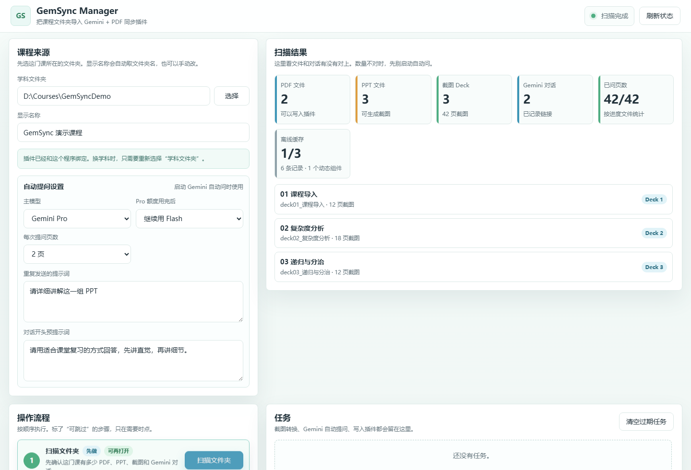
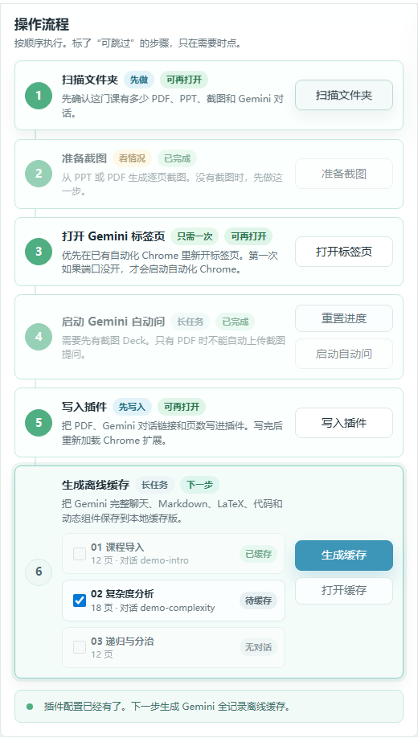
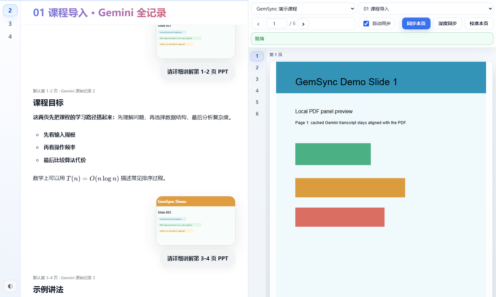

# GemSync Manager

GemSync Manager 是一个本地学习工具，用来把 Gemini 聊天记录和 PDF/PPT 页面同步到一起看。

它主要做三件事：

1. 把课程里的 PPT、PPTX 或 PDF 转成逐页截图。
2. 自动把每一页截图发给 Gemini，让 Gemini 按你的提示词讲解。
3. 生成 Chrome 插件配置，让你在 Gemini 页面旁边打开同步 PDF 面板。

这个公开仓库只包含程序源码、插件源码和示例配置。你的课程文件、Gemini 对话链接、日志、截图和本地配置都会留在你电脑上，不会被上传到 GitHub。

## 界面预览

下面的截图使用演示数据，不包含真实课程文件或 Gemini 对话记录。

### 管理器主界面



### 选择要生成的离线缓存



### 离线缓存阅读器



## 需要的环境

- Windows 10/11
- Node.js 20 或更新版本
- Google Chrome
- Python 3，并且命令行里能运行 `python`
- Poppler 命令行工具，至少需要 `pdftoppm` 和 `pdfinfo`
- Microsoft PowerPoint 或 LibreOffice，只在需要转换 PPT/PPTX 时使用；Windows 上默认优先用 PowerPoint，LibreOffice 作为开源兜底
- 一个可以正常登录 Gemini 的账号

## 一键配置环境

推荐先运行环境配置脚本：

```powershell
.\scripts\setup-env.ps1
```

这个脚本会自动做这些事：

1. 检测 Node.js、Python、Poppler、PowerPoint、LibreOffice 和 Chrome。
2. 已经安装的环境会直接复用。
3. 缺少的环境会提示你是否用 `winget` 安装。
4. 自动写入 GemSync 需要的环境变量。
5. 生成本地配置文件 `.gemsync.local.ps1`。
6. 自动运行 `npm install` 安装项目依赖。

如果你想不再逐个确认，直接安装缺少的环境：

```powershell
.\scripts\setup-env.ps1 -InstallMissing
```

如果你只想检查，不安装也不写入环境变量：

```powershell
.\scripts\setup-env.ps1 -CheckOnly
```

脚本生成的 `.gemsync.local.ps1` 只保存在你的电脑上，已经被 `.gitignore` 忽略，不会上传到 GitHub。

如果别人从 GitHub 下载这个项目，先运行上面的 `setup-env.ps1` 就行。脚本会复用他们电脑上已有的 PowerPoint；如果没有 PowerPoint，也会尝试安装/使用 LibreOffice。两者都没有时，管理器仍然可以启动和处理 PDF，但准备 PPT/PPTX 截图时会提示安装其中一个转换器。

## 手动配置环境

如果你不想用上面的脚本，也可以手动安装依赖。

安装 Node 依赖：

```powershell
npm install
```

如果 `node`、`python`、`pdftoppm` 或 `pdfinfo` 没有加入 PATH，可以在启动前设置环境变量：

```powershell
$env:GEMSYNC_NODE = "C:\Path\To\node.exe"
$env:GEMSYNC_PYTHON = "C:\Path\To\python.exe"
$env:GEMSYNC_PDFTOPPM = "C:\Path\To\pdftoppm.exe"
$env:GEMSYNC_PDFINFO = "C:\Path\To\pdfinfo.exe"
$env:GEMSYNC_SOFFICE = "C:\Path\To\soffice.exe"
$env:GEMSYNC_CHROME = "C:\Path\To\chrome.exe"
```

PPT/PPTX 转 PDF 默认是 `auto`：先试 PowerPoint，再试 LibreOffice。也可以手动指定：

```powershell
$env:GEMSYNC_PPT_CONVERTER = "powerpoint"   # 或 "libreoffice" / "auto"
```

## 启动管理器

在仓库目录下运行：

```powershell
.\start.ps1
```

也可以运行：

```powershell
npm start
```

然后打开：

```text
http://127.0.0.1:5188
```

## 安装 Chrome 插件

1. 打开 `chrome://extensions`。
2. 打开右上角的“开发者模式”。
3. 点击“加载已解压的扩展程序”。
4. 选择这个目录：

```text
<repo>\extension
```

加载或重新加载插件后，刷新 Gemini 页面。

## 基本使用流程

1. 启动 GemSync Manager。
2. 选择一门课所在的文件夹，里面可以放 PPT、PPTX 或 PDF。
3. 点击“扫描文件夹”。
4. 如果还没有截图，点击“准备截图”。
5. 点击“打开 Gemini 标签页”，第一次使用时先登录 Gemini。
6. 选择 Gemini 模型，并确认提示词。
7. 点击“启动 Gemini 自动问”。
8. 等 Gemini 全部讲完后，点击“写入插件”。
9. 勾选要缓存的 Gemini 对话，点击“生成离线缓存”，把 Gemini 完整聊天、公式、代码和动态组件保存到本地。
10. 重新加载 Chrome 插件。
11. 打开 Gemini 页面，点击悬浮的 `PDF` 按钮，就可以在旁边看同步 PDF 面板。

“自动提问设置”里可以填写“对话开头预提示词”。这个提示词只会在每个新 Gemini 对话开头单独发送一次，用来说明后续回答风格；后面的每一页仍然按“重复发送的提示词”正常提问。如果不填写，流程和以前一样。

同一个设置区也可以选择“每次提问页数”：支持一次上传 1、2 或 3 页 PPT 截图。这个设置会同时写入自动提问进度、插件配置和离线缓存映射；例如一次问 2 页时，PDF 第 1-2 页默认对应同一条 Gemini 用户消息，第 3-4 页对应下一条。设置了预提示词时，第 1 组 PPT 仍然从预提示词后面的第一条图片消息开始。

如果课程文件夹里后来又新增 PPT，重新扫描后会在“准备截图”步骤显示待截图课件；点击后只追加这些新课件，不会重做已经生成过截图的旧 Deck。子文件夹里的课件也会扫描；如果不同文件夹里有同名 PPT，会优先按完整路径判断，内部 PDF 会带上 deck 编号避免互相覆盖。Office 临时文件（例如 `~$course2.ppt`）会被忽略。

Gemini 自动提问会在新对话开始后把对话重命名为对应课件/deck 名。即使之前某次重命名失败，也不会被误记为成功；下次运行会继续尝试恢复命名。

PDF 面板和离线缓存面板默认按 Gemini 对话顺序同步页面；如果设置了预提示词，第 1 页默认从第 2 条 Gemini 用户对话开始。你点击“校准本页”后，这一页和当前 Gemini 对话会被写死为固定映射；重复页、漏问页或多出来的对话不会把已经校准过的页自动推到下一页。

## 离线缓存版

“生成离线缓存”会读取已经记录好的 Gemini 对话链接，把每个 Deck 的聊天记录保存到插件目录：

```text
<repo>\extension\pdf-panel\subjects\<subject-id>\transcripts
```

如果 Gemini 回复里有动态演示组件，程序也会尽量保存成可交互的本地 HTML：

```text
<repo>\extension\pdf-panel\subjects\<subject-id>\interactives
```

缓存版不会改写 Gemini 的原回答。它保存的是 Gemini 页面里已经生成的文字、Markdown、LaTeX、代码块、表格和动态组件。
使用这个功能前，需要自动化 Chrome 的 `9222` 端口打开，并且这个 Chrome 配置里已经登录 Gemini。
管理器页面里可以勾选要缓存的 Deck；已经生成过的缓存可以直接点“打开缓存”查看。
已经有本地缓存的 Deck 会显示“已缓存”并禁止重复勾选；如果选中的内容都已经缓存，管理器不会重写插件配置，也不会重新抓取 Gemini。

离线缓存页右侧的 PDF 章节切换只显示已经生成过本地 transcript 的章节。没有生成缓存的章节不会出现在离线阅读器的下拉框里，避免误以为已经缓存完成；切换章节时也会继续停留在离线缓存界面，不会自动打开 Gemini。

本地课程记录不会提交到 GitHub。`.gitignore` 默认忽略 `extension/pdf-panel/subjects.json`、`extension/pdf-panel/subjects/`、运行日志和课程截图目录；这些位置会保存你的 PDF、截图、Gemini 链接和离线 transcript。

也可以直接用命令行生成缓存：

```powershell
node .\scripts\cache_gemini_subject.mjs `
  --workspace "D:\你的课程文件夹" `
  --subject-id "your-subject-id" `
  --extension-root ".\extension"
```


## 环境变量

| 变量 | 作用 |
| --- | --- |
| `GEMSYNC_MANAGER_PORT` | 管理器端口，默认是 `5188`。 |
| `GEMSYNC_NODE` | 后台任务使用的 Node 程序，默认使用当前 Node 或 `node`。 |
| `GEMSYNC_PYTHON` | PPT 转截图辅助脚本使用的 Python，默认是 `python`。 |
| `GEMSYNC_PDFINFO` | `pdfinfo` 的路径，默认是 `pdfinfo`。 |
| `GEMSYNC_PDFTOPPM` | `pdftoppm` 的路径，默认是 `pdftoppm`。 |
| `GEMSYNC_SOFFICE` | LibreOffice `soffice.exe` 的路径；没有 PowerPoint 或指定 LibreOffice 转换时使用。 |
| `GEMSYNC_PPT_CONVERTER` | PPT/PPTX 转 PDF 方式，默认 `auto`，可设为 `powerpoint` 或 `libreoffice`。 |
| `GEMSYNC_CHROME` | Chrome 程序路径，默认会尝试找常见安装位置。 |
| `GEMSYNC_AUTOMATION_SCRIPTS` | 自动化脚本目录，默认是 `<repo>\scripts`。 |
| `GEMSYNC_DEFAULT_WORKSPACE` | 可选，默认课程文件夹。 |
| `GEMSYNC_DEFAULT_PRE_PROMPT` | 可选，每个新 Gemini 对话开头单独发送一次的预提示词。 |
| `GEMSYNC_DEFAULT_PROMPT` | 可选，默认重复发送给 Gemini 的提示词。 |
| `GEMSYNC_DEFAULT_PAGES_PER_PROMPT` | 可选，默认每次发给 Gemini 的 PPT 页数，支持 `1`、`2`、`3`。 |

## Chrome 自动化说明

Gemini 自动提问需要连接 Chrome DevTools，默认地址是：

```text
http://127.0.0.1:9222
```

管理器可以帮你打开自动化 Chrome 标签页。如果你想手动启动 Chrome，可以使用：

```powershell
chrome.exe --remote-debugging-port=9222 --user-data-dir="%TEMP%\gemsync-chrome" https://gemini.google.com/app
```

第一次使用时，需要在这个 Chrome 配置里登录 Gemini。

## 使用提醒

- 自动提问运行时，不要手动点击 Gemini 的发送按钮。
- 如果中途失败，可以重新运行，进度会保存在你选择的课程文件夹里。
- PDF/PPT 文件本身不会自动上传到 GitHub。只有当你启动 Gemini 自动问时，程序才会把页面截图发给 Gemini。
